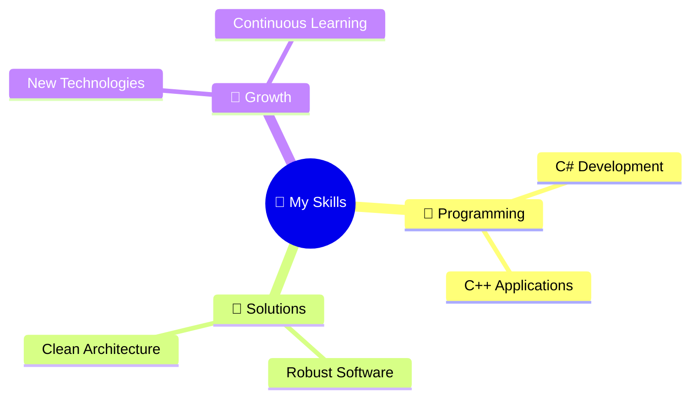

# 🐺 Hello! I'm Ulises Marín Vázquez

## 🎯 About Me

> *"I'm passionate about technology and programming. I'm self-taught, I love constantly learning, and I give my best to the biggest challenges."*

### 🦅 What I Do

<table align="center">
<tr>
<td align="center" width="33%">

**🔥 Core Programming**
 

 
*C# and C++ Development*

</td>
<td align="center" width="33%">

**🛠️ Software Solutions**
 

 
*Building Robust Applications*

</td>
<td align="center" width="33%">

**🌱 Always Learning**
 

 
*Exploring New Technologies*

</td>
</tr>
</table>

---

## 🐾 Technologies and Tools

### 🦊 Main Stack
I mainly work with **C++**, **.NET C#**, **Python** and **Java**

### 🐺 Programming Languages

### 🦌 Frameworks and Platforms

### 🐻 Development Tools

---

## 🦅 Connect With Me

---

  

